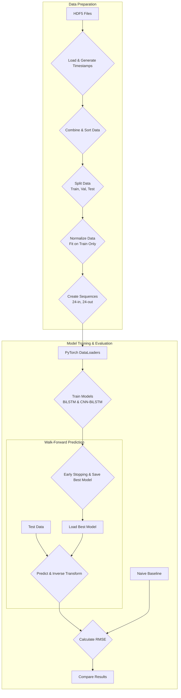

# Comprehensive Report on Time Series Forecasting Notebook

This report details the methodology, data processing, model architecture, and results of the time series forecasting implemented in this notebook. The objective is to replicate a paper's approach to short-term load forecasting using deep learning models.

### 1. Methodology

#### System Architecture



The core methodology involves predicting 24 hours of future electricity load (`P` in kW) based on the preceding 24 hours of load data. The overall workflow is as follows:

1.  **Data Loading & Preprocessing**: Load hourly aggregated power consumption data from multiple HDF5 files, combine them, and split the data into training, validation, and test sets.
2.  **Data Normalization**: Scale the data to a [0, 1] range using `MinMaxScaler` to improve model training stability and performance.
3.  **Model Preparation**: Structure the time series data into input-output sequences (24 hours in, 24 hours out) and load them into PyTorch `DataLoaders`.
4.  **Model Training**: Train two distinct deep learning models:
    *   A Bidirectional Long Short-Term Memory (BiLSTM) model.
    *   A hybrid model combining a Convolutional Neural Network (CNN) with a BiLSTM (CNN-BiLSTM).
    Training includes an early stopping mechanism based on validation loss to prevent overfitting.
5.  **Model Evaluation**: Evaluate the trained models on the unseen test set using a walk-forward prediction strategy. This involves making a 24-hour prediction, then shifting the input window forward by 24 hours for the next prediction.
6.  **Baseline Comparison**: Compare the performance of the deep learning models against a naive forecasting baseline, where the prediction for the next 24 hours is simply the data from the previous 24 hours.
7.  **Results Analysis**: The final performance metric is the Root Mean Squared Error (RMSE), calculated on the unscaled (original kW) predictions.

### 2. Dataset Processing

**Data Loading:**
*   **Source**: The data is sourced from three HDF5 files: `data/2018_data_spatial.hdf5`, `data/2019_data_spatial.hdf5`, and `data/2020_data_spatial.hdf5`.
*   **Function**: The `load_and_generate_timestamps` function is used to extract the pre-aggregated active power data (`P_TOT`) from the internal path `/NO_PV/60min/HOUSEHOLD/table`.
*   **Timestamp Generation**: Instead of using the timestamps from the files, the function generates a clean, hourly `DatetimeIndex` for each year, ensuring a consistent time series without gaps.

**Data Splitting:**
The combined DataFrame is chronologically split into three distinct sets:
*   **Training Set**: `2018-05-31` to `2019-12-31`
*   **Validation Set**: `2020-01-01` to `2020-06-30`
*   **Test Set**: `2020-07-01` to `2020-12-31`

**Data Normalization:**
*   **Technique**: `MinMaxScaler` from scikit-learn is used to scale the active power (`P`) values to the range [0, 1].
*   **Data Leakage Prevention**: The scaler is fitted **only** on the training data. The fitted scaler is then used to transform the training, validation, and test sets, preventing any information from the validation or test sets from influencing the training process.

### 3. Model Preparation

**Sequence Creation:**
*   The `create_sequences` function converts the continuous time series data into supervised learning samples.
*   **Input (`X`)**: A sequence of 24 consecutive hourly data points.
*   **Output (`Y`)**: The subsequent sequence of 24 hourly data points.
*   The final shape for the input data `X` is `(num_samples, 24, 1)`, and for the output data `Y` is `(num_samples, 24)`.

**Data Loaders:**
*   The sequenced data (X and Y) is converted into PyTorch tensors.
*   `TensorDataset` and `DataLoader` are used to create iterable batches of data for efficient model training.
*   The training loader shuffles the data at each epoch, while the validation and test loaders do not.

### 4. Model Parameters

The key hyperparameters used for the models and training process are derived from the paper:
*   **Batch Size**: `384`
*   **LSTM Hidden Size**: `200` units
*   **CNN Filters**: `64`
*   **CNN Kernel Size**: `3`
*   **Optimizer**: Adam with a learning rate of `0.001`
*   **Loss Function**: Mean Squared Error (MSE)
*   **Epochs**: `100` (maximum)
*   **Early Stopping Patience**: `15` (training stops if validation loss does not improve for 15 consecutive epochs)

### 5. Model Architecture

**BiLSTM Model:**

```mermaid
graph TD
    A[Input<br>(batch, 24, 1)] --> B{BiLSTM Layer<br>hidden_size=200};
    B --> C{Select Last Time Step<br>Output: (batch, 400)};
    C --> D{Dense Layer<br>ReLU, 200 units};
    D --> E[Output Layer<br>24 units];
end
```

1.  **Input Layer**: Takes a sequence of shape `(batch_size, 24, 1)`.
2.  **BiLSTM Layer**: A single-layer BiLSTM with `200` hidden units processes the input sequence. Being bidirectional, it processes the sequence in both forward and backward directions. The output shape is `(batch_size, 24, 400)`.
3.  **Output Selection**: The output from the **last time step** of the BiLSTM layer is selected, which has a shape of `(batch_size, 400)`. This vector contains information from the entire input sequence.
4.  **Dense Layers**: This vector is passed through two fully-connected (dense) layers:
    *   An intermediate layer that reduces the dimension from `400` to `200`, with a ReLU activation function.
    *   A final output layer that projects the `200` features to the desired `24` output predictions.

**CNN-BiLSTM Model:**

```mermaid
graph TD
    subgraph "CNN Feature Extractor"
        A[Input<br>(batch, 24, 1)] --> B{Permute<br>(batch, 1, 24)};
        B --> C{1D CNN<br>64 filters, kernel=3};
        C --> D{Max Pooling<br>kernel=2};
        D --> E{Flatten};
    end

    subgraph "BiLSTM Forecaster"
        E --> F{Repeat Vector<br>Sequence Length: 24};
        F --> G{BiLSTM Layer<br>hidden_size=200};
        G --> H{Select Last Time Step};
        H --> I{Dense Layer<br>ReLU, 200 units};
        I --> J[Output Layer<br>24 units];
    end
end
```

This model uses a CNN to extract features from the input sequence before feeding it to the BiLSTM.
1.  **Input Layer**: Takes a sequence of shape `(batch_size, 24, 1)`. The dimensions are permuted to `(batch_size, 1, 24)` to match the CNN's expected input format `(batch, channels, length)`.
2.  **1D CNN Layer**: A 1D convolutional layer with `64` filters and a kernel size of `3` is applied. It acts as a feature extractor, identifying short-term patterns in the data.
3.  **Max Pooling Layer**: A `MaxPool1d` layer with a kernel size of `2` is used to downsample the feature maps, making the representation more robust.
4.  **Flatten & Repeat**: The output from the pooling layer is flattened into a single vector. This vector is then repeated `24` times to form a new sequence, where each time step contains the features extracted by the CNN.
5.  **BiLSTM Layer**: This new sequence of extracted features is fed into a BiLSTM layer, identical to the one in the BiLSTM model.
6.  **Dense Layers**: The output of the BiLSTM is passed through the same dense layer structure as the BiLSTM model to produce the final 24-hour forecast.

### 6. Results

The models are evaluated on the test set, and their performance is measured by Root Mean Squared Error (RMSE) in kW. The results are compared against a naive baseline.

*   **BiLSTM Test RMSE**: The final RMSE achieved by the BiLSTM model on the test data.
*   **CNN-BiLSTM Test RMSE**: The final RMSE achieved by the CNN-BiLSTM model on the test data.
*   **Naive Forecasting Test RMSE**: The RMSE of the baseline model, which provides a benchmark for evaluating the effectiveness of the deep learning models.

The final printout compares these three RMSE values, providing a clear summary of which model performed best on the forecasting task. The results are divided by 1000 in the final printout, which appears to be an error, as the metric is already in kW. The values should be interpreted directly as kW.
